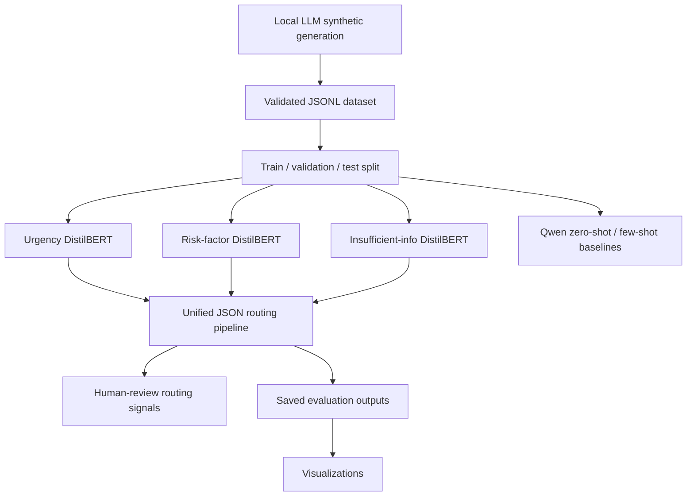

# Noisy Medical Intake Routing from Patient Portal Messages

Administrative routing signals for noisy patient portal messages using local LLM synthetic data generation, fine-tuned DistilBERT classifiers, Qwen prompting baselines, and a unified JSON inference pipeline.

This project is not for diagnosis, treatment, or autonomous clinical triage. It is an educational prototype that produces structured routing signals for human review.

## Overview

Patient portal messages are often short, informal, incomplete, typo-filled, or emotionally written. The goal of this project is to convert these noisy messages into administrative intake-routing signals:

- urgency level: `Green`, `Yellow`, or `Red`
- risk-factor labels
- insufficient-information flag
- final human-review routing decision

The repository keeps the original notebook as an experiment record and exposes the main workflow through command-line scripts in `src/`.

## Main Results

### Unified Pipeline on 50 Saved Test Examples

| Metric | Value |
|---|---:|
| Urgency accuracy | 0.76 |
| Risk exact-match accuracy | 0.92 |
| Insufficient-information accuracy | 0.86 |
| Human review rate | 0.72 |

### Model and Baseline Results

| Experiment | Result |
|---|---:|
| Synthetic generation success rate | 93.3% |
| Urgency DistilBERT accuracy | 0.8095 |
| Urgency DistilBERT macro-F1 | 0.8104 |
| Risk-factor DistilBERT best threshold | 0.30 |
| Risk-factor DistilBERT micro-F1 | 0.8792 |
| Risk-factor DistilBERT macro-F1 | 0.7775 |
| Insufficient-info DistilBERT accuracy | 0.8690 |
| Insufficient-info DistilBERT macro-F1 | 0.7945 |
| Zero-shot Qwen urgency accuracy | 0.34 |
| Few-shot Qwen urgency accuracy | 0.25 |

## Project Motivation

Administrative intake teams need to route patient portal messages quickly, but patient-written messages can be noisy:

- symptoms may be described indirectly or emotionally
- clinically important context may be missing
- patients may mix administrative requests with symptom descriptions
- a message may require human review even when it is not a diagnostic task

This project investigates whether a modular LLM/NLP pipeline can help structure those messages for review while keeping humans in the loop.

## Problem Statement

Given a noisy patient portal message, predict:

1. `urgency_level`: `Green`, `Yellow`, or `Red`
2. `risk_factors`: one or more administrative risk signals
3. `insufficient_information`: whether the message lacks enough detail
4. `routing`: whether human review is required and which queue/action should receive the message

The main research question is:

> Can a synthetic-data workflow plus lightweight fine-tuned classifiers produce useful administrative routing signals from noisy patient portal messages?

## Visual Abstract / Pipeline



Generated visuals are stored under `visuals/`:

- `urgency_confusion_matrix.png`
- `insufficient_confusion_matrix.png`
- `routing_distribution.png`
- `risk_factor_true_vs_predicted_counts.png`
- `risk_threshold_tuning_curve.png`

## Dataset

The project uses a synthetic dataset generated for this course project.

### Data Schema

The scripts accept the original notebook schema:

```json
{
  "task_id": "example-001",
  "text": "I have chest pressure and feel short of breath.",
  "labels": {
    "urgency_level": "Red",
    "risk_factors": ["Chest_Pain_or_Pressure", "Respiratory_Distress"],
    "insufficient_information": false
  }
}
```

The loaders also accept a flatter schema with `message`, `urgency`, `risk_factors`, and `insufficient_info`.

### Split

| Split | Count |
|---|---:|
| Train | 1,958 |
| Validation | 420 |
| Test | 420 |

Large generated datasets and model checkpoints are not included in the repository.

## Synthetic Data Generation

Synthetic messages were generated with a local Qwen instruction model and validated into JSONL records.

| Generation Metric | Value |
|---|---:|
| Generation tasks | 3,000 |
| Valid examples | 2,799 |
| Failed examples | 201 |
| Success rate | 93.3% |

Generation code:

```bash
python src/generate_synthetic_data.py \
  --model Qwen/Qwen2.5-0.5B-Instruct \
  --num-tasks 3000 \
  --output data/generated/synthetic_valid.jsonl \
  --failed-output data/generated/synthetic_failed.jsonl
```

## Models and Pipelines

| Component | Method | Output |
|---|---|---|
| Synthetic generation | Local Qwen instruction model | Labeled patient portal messages |
| Urgency classifier | DistilBERT | `Green`, `Yellow`, `Red` |
| Risk-factor classifier | DistilBERT multi-label classifier | Risk-factor labels |
| Insufficient-info classifier | DistilBERT binary classifier | Sufficient / insufficient |
| Prompting baselines | Qwen zero-shot and few-shot | Urgency label |
| Unified pipeline | Combined classifier outputs | JSON routing object |

The unified pipeline is intentionally administrative. It does not produce diagnosis or treatment advice.

## Training Process

The notebook records the original experimental process. The repository provides command-line scripts for each major stage:

```bash
python src/split_dataset.py --input data/sample_data/example_messages.jsonl --output-dir data/splits
python src/train_urgency_model.py --data-dir data/splits --output-dir models/urgency_distilbert
python src/train_risk_factor_model.py --data-dir data/splits --output-dir models/risk_factor_distilbert --threshold 0.30
python src/train_insufficient_info_model.py --data-dir data/splits --output-dir models/insufficient_info_distilbert
python src/tune_risk_threshold.py --model-dir models/risk_factor_distilbert --validation-file data/splits/validation.jsonl --output results/risk_threshold_tuning.json
```

Model files, checkpoints, `.safetensors`, `.bin`, and `.venv` are excluded from version control.

## Metrics

The project reports:

- accuracy and macro-F1 for urgency classification
- micro-F1 and macro-F1 for risk-factor multi-label classification
- accuracy, macro-F1, and F1 for the insufficient class
- exact-match accuracy for risk labels in the unified pipeline
- human review rate for the final routing output

Saved pipeline metrics can be reproduced from checked-in results:

```bash
python src/evaluate_pipeline.py \
  --labels-file data/test_from_pipeline_outputs.jsonl \
  --predictions-file results/pipeline_test_outputs.jsonl \
  --output results/pipeline_evaluation_summary.json
```

## Error Analysis

The saved 50-example pipeline output shows:

- urgency errors mainly around the `Green`/`Yellow` boundary
- risk-factor exact match remained high at 0.92
- insufficient-information accuracy was 0.86, with missed insufficient cases still possible
- 72% of examples were routed to a human-review path

Use the generated confusion matrices and count plots in `visuals/` for a compact view of these patterns.

## Limitations

- The dataset is synthetic and not clinically validated.
- The system is not a medical device and is not intended for diagnosis or treatment.
- The unified pipeline evaluation shown here uses 50 saved test examples.
- The threshold tuning JSON currently stores the selected threshold summary; full sweep results may be regenerated if needed.
- Human review is still required for any real intake workflow.

## Future Work

Potential improvements:

- validate labels and routing decisions with clinical or administrative experts
- expand the saved evaluation set
- test additional local LLMs for synthetic generation and prompting baselines
- calibrate confidence thresholds for human-review routing
- add richer error analysis by risk-factor category
- evaluate robustness to typos, short messages, and missing context

## Repository Structure

```text
noisy-medical-intake-routing/
|-- README.md
|-- requirements.txt
|-- .gitignore
|-- notebooks/
|   `-- LLM_project.ipynb
|-- src/
|   |-- config.py
|   |-- data_utils.py
|   |-- metrics_utils.py
|   |-- generate_synthetic_data.py
|   |-- split_dataset.py
|   |-- train_urgency_model.py
|   |-- train_risk_factor_model.py
|   |-- tune_risk_threshold.py
|   |-- train_insufficient_info_model.py
|   |-- run_prompt_baselines.py
|   |-- inference_pipeline.py
|   |-- evaluate_pipeline.py
|   `-- create_visuals.py
|-- data/
|   |-- README.md
|   |-- test_from_pipeline_outputs.jsonl
|   `-- sample_data/
|-- models/
|   `-- README.md
|-- results/
|   |-- model_results_summary.md
|   |-- pipeline_test_outputs.csv
|   |-- pipeline_test_outputs.jsonl
|   |-- pipeline_evaluation_summary.json
|   `-- risk_factor_threshold_tuning_results.json
|-- slides/
|   `-- final_presentation.pdf
`-- visuals/
    |-- urgency_confusion_matrix.png
    |-- insufficient_confusion_matrix.png
    |-- routing_distribution.png
    |-- risk_factor_true_vs_predicted_counts.png
    `-- risk_threshold_tuning_curve.png
```

This project is text-only, so there is no `audio/` folder.

## How to Run

Install dependencies:

```bash
pip install -r requirements.txt
```

Compile source files:

```bash
python -m compileall src
```

Reproduce saved pipeline evaluation:

```bash
python src/evaluate_pipeline.py \
  --labels-file data/test_from_pipeline_outputs.jsonl \
  --predictions-file results/pipeline_test_outputs.jsonl \
  --output results/pipeline_evaluation_summary.json
```

Generate visualizations from saved results:

```bash
python src/create_visuals.py
```

Run unified routing after trained models are available locally:

```bash
python src/inference_pipeline.py \
  --input-file data/splits/test.jsonl \
  --urgency-model-dir models/urgency_distilbert \
  --risk-model-dir models/risk_factor_distilbert \
  --insufficient-model-dir models/insufficient_info_distilbert \
  --output results/pipeline_predictions.jsonl
```

## Safety Note

This repository is a course project and research prototype. It should not be used to provide medical advice, diagnose patients, determine treatment, or replace clinical intake staff.
