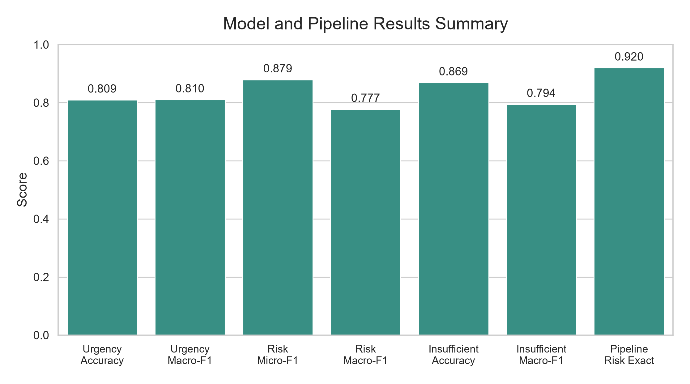
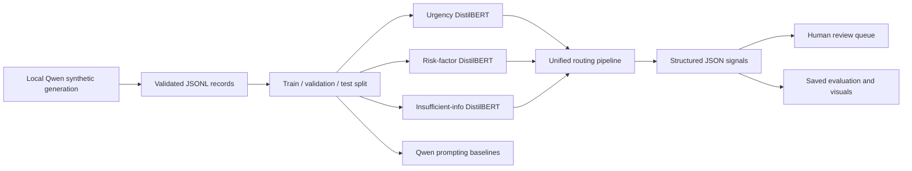
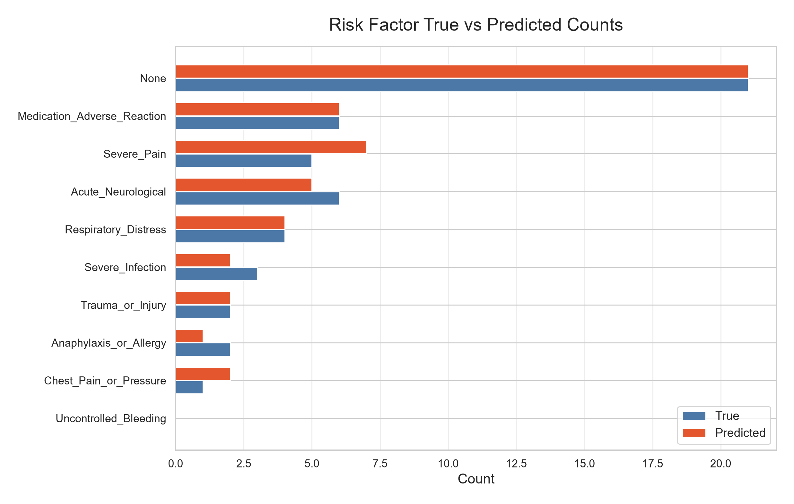

# Patient Portal Triage

Administrative intake-routing signals for noisy patient portal messages using
local-LLM synthetic data, fine-tuned DistilBERT classifiers, Qwen prompting
baselines, and a unified JSON pipeline.

> **Safety note:** This educational prototype supports administrative human
> review only. It is not intended for diagnosis, treatment, medical advice, or
> autonomous clinical decision-making.

## Project at a Glance

| Item | Details |
|---|---|
| Team member | Dor Istrik |
| Input modality | Text-only patient portal messages |
| Primary model | `distilbert-base-uncased` |
| Synthetic generator / baseline | `Qwen/Qwen2.5-0.5B-Instruct` |
| Routing labels | `Green`, `Yellow`, `Red` |
| Selected risk threshold | `0.30` |
| Final evaluation | 50 saved test examples |

### Key Links

- [Original experiment notebook](notebooks/LLM_project.ipynb)
- [Sample portal messages](data/sample_data/example_messages.jsonl)
- [Data documentation](data/README.md)
- [Model results summary](results/model_results_summary.md)
- [Pipeline evaluation JSON](results/pipeline_evaluation_summary.json)
- [Pipeline outputs CSV](results/pipeline_test_outputs.csv)
- [Pipeline outputs JSONL](results/pipeline_test_outputs.jsonl)
- [Risk-threshold results](results/risk_factor_threshold_tuning_results.json)
- [Compact results figure](visuals/model_results_summary.png)
- [Final presentation PDF](slides/Patient_Portal_Triage_Dor_Istrik.pdf)

## Overview

Patient-written portal messages are often short, informal, incomplete,
typo-filled, or emotionally phrased. This project converts that noisy text into
four structured signals that can help staff review an intake queue:

1. urgency level: `Green`, `Yellow`, or `Red`
2. one or more risk-factor labels
3. an insufficient-information flag
4. a final human-review routing action

The original notebook is retained as the experiment record. The reusable
workflow is organized into command-line scripts under `src/`.

## Main Results

### Unified Pipeline on 50 Saved Test Examples

| Metric | Value |
|---|---:|
| Urgency accuracy | **0.76** |
| Risk exact-match accuracy | **0.92** |
| Insufficient-information accuracy | **0.86** |
| Human review rate | **0.72** |



## Project Motivation

Administrative intake teams must review messages that mix symptoms,
administrative requests, missing context, and informal language. A structured
routing layer can make the queue easier to scan and audit while leaving the
actual review decision with a person.

The project asks whether synthetic data and compact local models can provide
useful routing signals without relying on a large hosted inference service for
every message.

## Problem Statement

Given a noisy patient portal message, predict:

- `urgency_level`: `Green`, `Yellow`, or `Red`
- `risk_factors`: zero or more labels from the project taxonomy
- `insufficient_information`: whether important message detail is missing
- `routing`: whether human review is required and the target action

The research question is:

> Can a synthetic-data workflow plus lightweight fine-tuned classifiers produce
> useful, reviewable administrative routing signals from noisy portal text?

## Novelty and Contribution

The contribution is the combination of four pieces in one reproducible,
text-only course project:

- controlled local-LLM generation of noisy portal messages and structured labels
- separate specialist classifiers for urgency, risk factors, and missing detail
- direct comparison with zero-shot and few-shot Qwen urgency prompting
- one auditable JSON routing output that keeps each prediction visible

The modular design makes it possible to evaluate each signal independently
before combining it into the final review route.

## Visual Abstract / Pipeline



## Datasets Used or Generated

The project uses a synthetic dataset created for this course project. Full
generated datasets are intentionally excluded from Git; the repository includes
a small demo file and the 50 examples needed to reproduce the saved pipeline
evaluation.

### Generation and Split Summary

| Stage | Count |
|---|---:|
| Generation tasks | 3,000 |
| Valid examples | 2,799 |
| Failed examples | 201 |
| Generation success rate | 93.3% |
| Training split | 1,958 |
| Validation split | 420 |
| Test split | 420 |

### Labeled Record Schema

```json
{
  "task_id": "example-001",
  "text": "Portal message text",
  "labels": {
    "urgency_level": "Yellow",
    "risk_factors": ["Severe_Pain"],
    "insufficient_information": true
  }
}
```

The data utilities also accept a flatter schema using `message`, `urgency`,
`risk_factors`, and `insufficient_info` fields.

Included data artifacts:

- [Synthetic demo records](data/sample_data/example_messages.jsonl)
- [Evaluation labels reconstructed from saved outputs](data/test_from_pipeline_outputs.jsonl)
- [Data folder guidance](data/README.md)

## Synthetic Data Generation Method

Synthetic examples were generated with a local Qwen instruction model and
validated before training. The workflow was:

1. define an urgency, risk-factor, and information-completeness task
2. prompt the local model to write a noisy portal-style message
3. parse the generated response into the expected schema
4. reject malformed or incomplete records
5. save valid and failed generations separately
6. split valid examples into train, validation, and test sets

Generation command:

```bash
python src/generate_synthetic_data.py --model Qwen/Qwen2.5-0.5B-Instruct --num-tasks 3000 --output data/generated/synthetic_valid.jsonl --failed-output data/generated/synthetic_failed.jsonl
```

## Input / Output Examples

### Input

```json
{
  "id": "portal-001",
  "message": "My tongue is swelling and I feel faint. Please call me."
}
```

### Structured Routing Output

```json
{
  "input_message": "My tongue is swelling and I feel faint. Please call me.",
  "analysis": {
    "urgency": "Red",
    "urgency_confidence": 0.8081,
    "risk_factors": ["Anaphylaxis_or_Allergy"],
    "insufficient": "Sufficient",
    "insufficient_confidence": 0.9767
  },
  "routing": {
    "needs_human_review": true,
    "target_action": "Immediate human review"
  }
}
```

Confidence values are retained for inspection; they do not replace human review.

## Models and Pipelines Used

| Component | Method | Output |
|---|---|---|
| Synthetic generation | Local Qwen instruction model | Labeled noisy messages |
| Urgency classifier | DistilBERT, 3-class classification | `Green`, `Yellow`, `Red` |
| Risk-factor classifier | DistilBERT, multi-label classification | Risk-factor list |
| Insufficient-info classifier | DistilBERT, binary classification | Sufficient / insufficient |
| Prompting baselines | Qwen zero-shot and few-shot | Urgency label |
| Unified pipeline | Rule-based composition of classifier outputs | JSON routing object |

### Why DistilBERT

DistilBERT provides contextual text representations with a smaller inference and
training footprint than full BERT. It is a practical fit for three short-text
classification tasks, local course-project compute, and independently testable
prediction heads.

## Training Process and Parameters

All three fine-tuned classifiers share the same default training configuration.
Command-line arguments can override these values.

| Parameter | Default |
|---|---:|
| Base model | `distilbert-base-uncased` |
| Maximum sequence length | 160 tokens |
| Epochs | 3 |
| Train / evaluation batch size | 16 |
| Learning rate | `2e-5` |
| Weight decay | `0.01` |
| Random seed | 42 |
| Evaluation and checkpoint frequency | Every epoch |
| Saved checkpoints retained locally | 2 |

Best-model selection:

| Task | Selection metric |
|---|---|
| Urgency | Validation macro-F1 |
| Risk factors | Validation micro-F1 |
| Insufficient information | Validation macro-F1 |

The risk-factor tuning script evaluates thresholds from `0.10` through `0.70`.
The selected and deployed threshold remains **0.30**.

## Metrics

- **Urgency:** accuracy and macro-F1
- **Risk factors:** micro-F1, macro-F1, precision, recall, and exact match
- **Insufficient information:** accuracy, macro-F1, and per-class F1
- **Unified pipeline:** urgency accuracy, risk exact-match accuracy,
  insufficient-information accuracy, and human review rate

## Results

### Fine-Tuned Models and Prompting Baselines

| Experiment | Accuracy | Macro-F1 | Other |
|---|---:|---:|---|
| Urgency DistilBERT | 0.8095 | 0.8104 | - |
| Risk-factor DistilBERT | - | 0.7775 | Micro-F1 0.8792; threshold 0.30 |
| Insufficient-info DistilBERT | 0.8690 | 0.7945 | F1 insufficient 0.6707 |
| Zero-shot Qwen urgency | 0.34 | 0.2949 | - |
| Few-shot Qwen urgency | 0.25 | 0.2080 | - |

Detailed saved results:

- [Model results summary](results/model_results_summary.md)
- [Pipeline evaluation summary](results/pipeline_evaluation_summary.json)
- [Pipeline outputs CSV](results/pipeline_test_outputs.csv)
- [Pipeline outputs JSONL](results/pipeline_test_outputs.jsonl)
- [Risk-factor threshold results](results/risk_factor_threshold_tuning_results.json)

## Visualizations

All figures are generated from saved results. Running the visualization script
does not rerun model inference.

| Results overview | Risk-threshold selection |
|---|---|
|  |  |

| Urgency errors | Insufficient-information errors |
|---|---|
|  |  |

| Routing behavior | Risk-factor counts |
|---|---|
|  |  |

Direct links:

- [Urgency confusion matrix](visuals/urgency_confusion_matrix.png)
- [Insufficient-information confusion matrix](visuals/insufficient_confusion_matrix.png)
- [Routing distribution](visuals/routing_distribution.png)
- [Risk-factor true vs predicted counts](visuals/risk_factor_true_vs_predicted_counts.png)
- [Risk-threshold tuning summary](visuals/risk_threshold_tuning_curve.png)
- [Compact model results summary](visuals/model_results_summary.png)

## Error Analysis

The saved 50-example evaluation shows:

- urgency mistakes are concentrated near adjacent routing boundaries
- risk-factor exact match is high, but sparse or ambiguous factors can still be missed
- insufficient-information errors occur when context is implied rather than stated
- 72% of examples are routed to a human-review path

The confusion matrices and count plots should be interpreted together with the
small evaluation size.

## Limitations

- The dataset is synthetic and has not been clinically validated.
- The unified pipeline evaluation contains 50 saved examples.
- The risk-threshold JSON contains the selected-threshold summary rather than a
  complete saved sweep, so the plot does not invent missing points.
- Confidence values are model scores, not calibrated clinical probabilities.
- Real deployment would require workflow-specific validation, monitoring, and
  expert review.

## Future Work

- validate labels and routing decisions with clinical and administrative experts
- expand evaluation on realistic, independently reviewed portal messages
- test calibration and confidence-aware deferral strategies
- compare additional compact encoders and local instruction models
- add subgroup and robustness analysis for typos, brevity, and missing context
- measure reviewer agreement, queue efficiency, and failure modes prospectively

## Repository Structure

```text
noisy-medical-intake-routing/
|-- README.md
|-- requirements.txt
|-- .gitignore
|-- notebooks/
|   `-- LLM_project.ipynb
|-- src/
|   |-- config.py
|   |-- data_utils.py
|   |-- metrics_utils.py
|   |-- generate_synthetic_data.py
|   |-- split_dataset.py
|   |-- train_urgency_model.py
|   |-- train_risk_factor_model.py
|   |-- tune_risk_threshold.py
|   |-- train_insufficient_info_model.py
|   |-- run_prompt_baselines.py
|   |-- inference_pipeline.py
|   |-- evaluate_pipeline.py
|   `-- create_visuals.py
|-- data/
|   |-- README.md
|   |-- test_from_pipeline_outputs.jsonl
|   `-- sample_data/
|       `-- example_messages.jsonl
|-- models/
|   `-- README.md
|-- results/
|   |-- model_results_summary.md
|   |-- pipeline_evaluation_summary.json
|   |-- pipeline_test_outputs.csv
|   |-- pipeline_test_outputs.jsonl
|   `-- risk_factor_threshold_tuning_results.json
|-- visuals/
|   |-- model_results_summary.png
|   |-- urgency_confusion_matrix.png
|   |-- insufficient_confusion_matrix.png
|   |-- routing_distribution.png
|   |-- risk_factor_true_vs_predicted_counts.png
|   `-- risk_threshold_tuning_curve.png
`-- slides/
    `-- Patient_Portal_Triage_Dor_Istrik.pdf
```

### Folder Guide

- `src/`: modular command-line implementation
- `notebooks/`: original experiment record
- `data/`: documentation, demo records, and saved evaluation labels
- `results/`: compact CSV, JSON, JSONL, and Markdown experiment outputs
- `visuals/`: figures regenerated from saved outputs
- `slides/`: final presentation PDF
- `models/`: local output location; large artifacts are excluded

The project is text-only and intentionally has no audio-related folder.

## How to Run

### 1. Install Dependencies

```bash
pip install -r requirements.txt
```

### 2. Compile the Source

```bash
python -m compileall src
```

### 3. Reproduce the Saved Pipeline Evaluation

```bash
python src/evaluate_pipeline.py --labels-file data/test_from_pipeline_outputs.jsonl --predictions-file results/pipeline_test_outputs.jsonl --output results/pipeline_evaluation_summary.json
```

### 4. Regenerate All Visuals

```bash
python src/create_visuals.py
```

### 5. Train Models Locally

After creating local train, validation, and test splits:

```bash
python src/train_urgency_model.py --data-dir data/splits --output-dir models/urgency_distilbert
python src/train_risk_factor_model.py --data-dir data/splits --output-dir models/risk_factor_distilbert --threshold 0.30
python src/train_insufficient_info_model.py --data-dir data/splits --output-dir models/insufficient_info_distilbert
```

### 6. Run Unified Routing

```bash
python src/inference_pipeline.py --input-file data/splits/test.jsonl --urgency-model-dir models/urgency_distilbert --risk-model-dir models/risk_factor_distilbert --insufficient-model-dir models/insufficient_info_distilbert --output results/pipeline_predictions.jsonl
```

Large generated datasets, environments, model weights, and checkpoints remain
local and are excluded through `.gitignore`.
